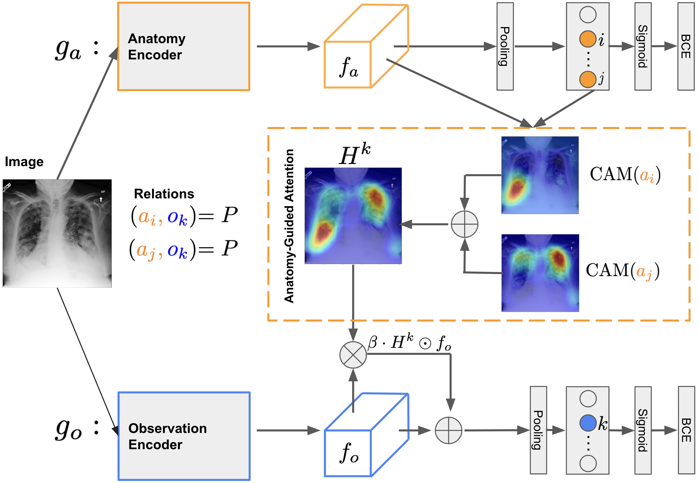

# Anatomy-Guided Weakly-Supervised Abnormality Localization in Chest X-rays
PyTorch implementation for paper *Anatomy-Guided Weakly-Supervised Abnormality Localization in Chest X-rays, accepted by MICCAI 2022*.

Ke Yu, Shantanu Ghosh, Zhexiong Liu, Christopher Deible, and Kayhan Batmanghelich

  

## Abstract
Creating a large-scale dataset of abnormality annotation on medical images is a labor-intensive and costly task. Leveraging weak supervision from readily available data such as radiology reports can compensate lack of large-scale data for anomaly detection methods. However, most of the current methods only use image-level pathological observations, failing to utilize the relevant anatomy mentions in reports. Furthermore, Natural Language Processing (NLP)-mined weak labels are noisy due to label sparsity and linguistic ambiguity. We propose an Anatomy-Guided chest X-ray Network (AGXNet) to address these issues of weak annotation. Our framework consists of a cascade of two networks, one responsible for identifying anatomical abnormalities and the second responsible for pathological observations. The critical component in our framework is an anatomy-guided attention module that aids the downstream observation network in focusing on the relevant anatomical regions generated by the anatomy network. We use Positive Unlabeled (PU) learning to account for the fact that lack of mention does not necessarily mean a negative label. Our quantitative and qualitative results on the MIMIC-CXR dataset demonstrate the effectiveness of AGXNet in disease and anatomical abnormality localization. Experiments on the NIH Chest X-ray dataset show that the learned feature representations are transferable and can achieve the state-of-the-art performances in disease classification and competitive disease localization results.

### Data Requirements and Download Links
- [MIMIC-CXR](https://physionet.org/content/mimic-cxr-jpg/2.0.0/)
- [RadGraph](https://physionet.org/content/radgraph/1.0.0/)
- [NVIDIA Annotation](https://github.com/leotam/MIMIC-CXR-annotations)
- [Chest ImaGenome](https://physionet.org/content/chest-imagenome/1.0.0/)

### Data Preprocessing
1. Run ./preprocessing/radgraph_itemized.py to generate itemized RadGraph examples.
2. Run ./preprocessing/radgraph_parsed.py to parse RadGraph relations.
3. Run ./preprocessing/adj_matrix.py to create adjacency matrix that represents the relations between anatomical landmarks and observations mentioned in radiology reports. 
